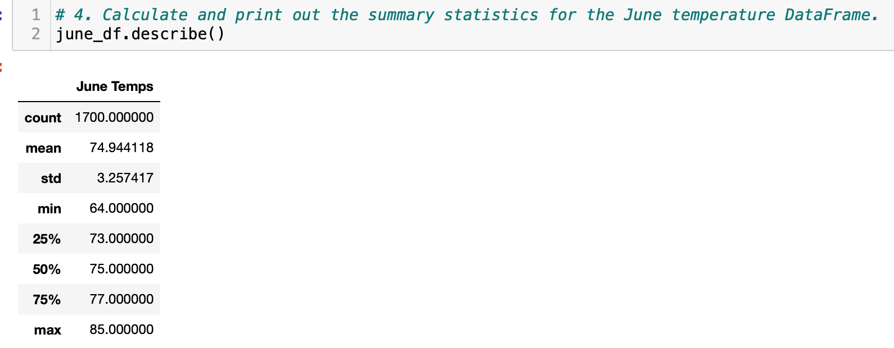
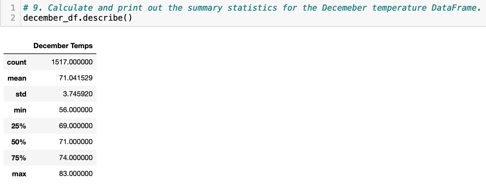

# surfs_up

# **Purpose**
The purpose of this assignment was to help an investor determine if opening a new surf and ice cream shop in a specific location was going to be a success. The investor wanted temperature trends in Oahu, specifically, temperature data for the months of June and December to see if the business could be profitable year round.

## **Goal**
- Retrieve Summary Statistics for June
- Retrieve Summary Statistics for December
- Written statistical analysis 

## **Resources**
- Resources: hawaii.sqlite
- Software: SQLite, SQLAlchemy, Flask, Visual Studio Code, Python, Pandas, MatPlotLib

## **Results**
In order to retrieve the summary statistics for June the following steps were taken:
- Import dependencies
- Reflect tables
- Save references from the tables
- Create a session
- Write query that retrieves temperatures for the month of June
- Convert the temperatures into a list
- Create a dataframe of the June temperatures
- Get summary statistics for the June dataframe 

In order to retrieve the summary statistics for December the following steps were taken:
- Write query that retrieves temperatures for the month of December
- Convert the temperatures into a list
- Create a dataframe of the December temperatures
- Get summary statistics for the December dataframe 

Key takeaways from the results:
- The average temperature in June is 74.9 degrees and 71 in December.
- June has a minimum temperature of 64 and a max of 85 while December has a minimum temperature of 56 and a max of 83. 
- The standard deviation of June is low at 3.2 and low in December at 3.7.

## **Summary**
Based on the analysis, the temperatures are similar in both June and December with the averages being 74.9 and 71 respectively. While December does have instances where the low is almost 10 degrees cooler than the minimum of June, on average both months have similar temperatures. Both months also have a similar low standard deviation, meaning that daily temperatures do not stray too far from the mean.

While this information does provide us some insight into the weather of Oahu, I believe further analysis is needed to make an informed decision. 

First I believe it is crucial to determine what month has the lowest and highest temperatures. This could be done by running a query for the temperatures of each month and turning each month into a dataframe. From there you can get the summary statistics to determine which month has the lowest and highest average temperatures and the actual minimum temperature is vs the max. The averages of all months should be plotted over the year to see the relationship of seasonality to temperature. 

The next query I would run would be to see the summary statistics for precipitation in every month. This would help determine which months have the most total rain. Then query that further to determine the exact count of days each month reported rain.
Overall this information would show how the temperature fluctuates throughout the year and how many rainy days to anticipate each month.

